# Wandaroo Guru

Do you want to see the world? Do you have a budget? Do you know you can have both of these at the same time? Wandaroo Guru is here to help you explore the world without breaking your bank! Explore different destinations across the world with an additional perspective: Your Budget! This website is here to help anyone looking for budget conscious travel suggestions with their estimated costs and photos from the lens of other travelers who visited them!

# Contents

1. [UX Design](#ux-design)
    - [Wireframe Design](#wireframe-design)
    - [Hero Image](#hero-image)
    - [Colours](#colours)
    - [Fonts](#fonts)
2. [User Stories](#user-stories)
3. [Features](#features)
4. [A.I. Integration](#ai-integration)
5. [Testing](#testing)
6. [Bugs](#bugs)
7. [Deployment](#deployment)
8. [Credits/Technologies Used](#credits)
9. [Future Features](#future-features)
10. [Team Collaboration](#team-collaboration)

## UX Design

### Wireframe Design

## Colours
The color scheme is inspired by the vibrant and captivating hero image that greets users upon landing on the site. The primary colors were carefully selected to reflect the adventurous and budget-friendly spirit of the platform. These colors were then fine-tuned to create a balanced palette that is both visually appealing and functional, ensuring readability and a pleasant user experience whilst maintaining a professional and trustworthy appearance.

## Fonts

### Cavet Bush 

- Reasoning: Filtered google fonts for playful and handwritten fonts to match the target vibe for the website for headings

### Kanit font
A visually striking font that captures attention and enhances the overall aesthetic of the design.

### Gloria Hallelujah
A playful and handwritten font that complements the adventurous and budget-friendly vibe of the platform.

### Lexend font

Easy read fonts that have been developed to  reduce reading fatigue and make reading more accessible for those with reading difficulties.

## User Stories

#### User Story 1

<em>As a user, I want to be able to choose my desired budget and see destinations within that range so I can pick my desired destination based on what i can afford</em>

#### User Story 2

<em>As a user, I want to be able to enter the length of my desired stay and my budget for feeding, accommodation and activities so I can calculate the total cost of my desired trip</em>

#### User Story 3

<em>As a user, I want to see top destinations when I initially visit the site so I can choose my desired destination when I have no budget constraints</em>

#### User Story 4

<em>As a user, I want a website that is responsive so I can use it on all my devices</em>

#### User Story 5

<em>As a user, I want to be able to see visual representations of the various destinations so I can make my choice based on it's aesthetic </em>

## Features

- **Navigation**

The navigation section of the page was designed to allow the user to navigate through the different sections of the page with flexibility. Also, the logo and name of the company were added to differentiate the website from other websites offering similar services 

- **Hero Image**

The hero image was chosen to reflect the overall theme of the website. To allow users achieve their goal of seeing destinations based on a budget they input, a slider was designed that triggers dynamically generated cards based on the inputted price range 

- **Call to Action Button**

The main call to action button for this website is the find my destination button which allows users see what destinations are within their budget 

- **Budget Slider**

- **Destinations based on budget**

Destinations based on the users budget are generated as cards and focus on describing the budget users should be aware of if they visit the recommended destination. 

- **Default Destinations**

When users visit the page they are presented with default destinations that might interest them. This was designed for users who want to find their next travel destination but they are not constricted to price ranges. These cards also include a learn more button which allows interested users to book the destination 

- **Budget Calculator**

Budget calculator is an essential tool that was designed to allow users generate an estimate of the total budget they have. It focuses on calculating the total budget for their travel by factoring in the price per night they aim to spend on food, transport and activities, taking into consideration the number of guests 

- **Interactive Map**

Used a third-paty tool Leaflet to display a map that shows the different locations highlighted as possible destinations for the users

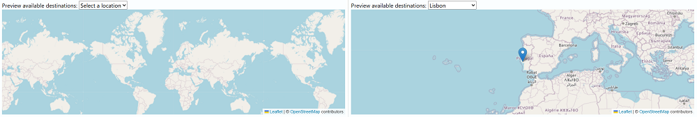

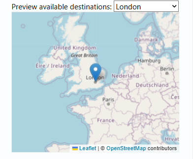

- **About**

The About section provides an overview of our mission, values, and the inspiration behind creating Wandaroo Guru, emphasizing our commitment to making travel accessible and affordable for everyone.
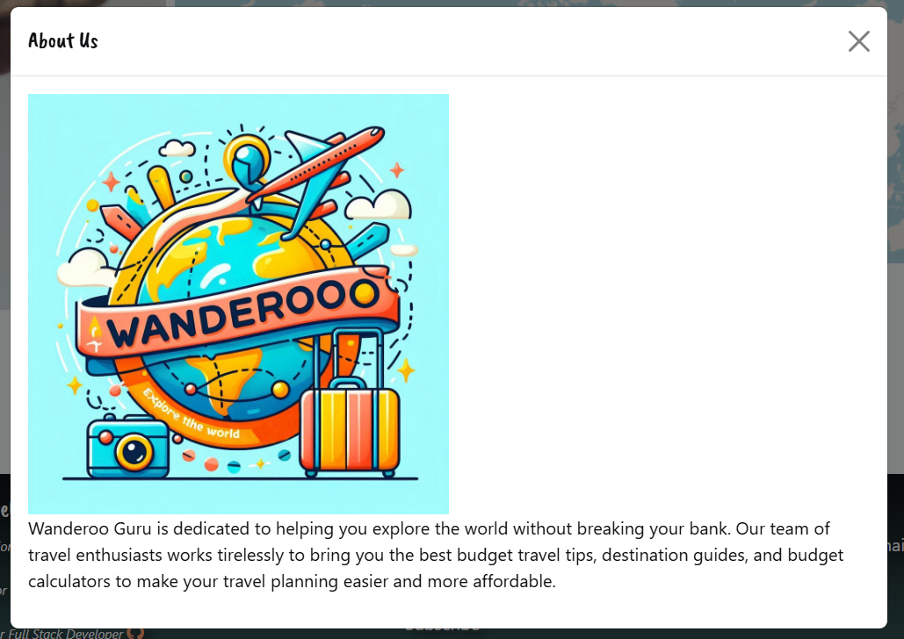

- **Footer**

The footer was designed to showcase the team behind the website 

## A.I. Integration

Copilot was employed to generate strategic planning ideas for the team. These AI-generated suggestions were subsequently refined to align with the specific project requirements.

**Idea Generation**

- Identifing popular holiday destinations from the UK, which served as the foundational dataset for our resort catalog.

- Generate logo designs based on specified instructions.

**Development Support**

- Used AI to learn how to style the thumb in range elements which allowed me learn more about how browser compatability affects the styling of elements on different web browsers

- Used AI to generate the header of the hero section "Explore the world without breaking your bank!"

- Used AI to generate the dummy costs of the travelling to the various destinations

## Testing

### User Story Testing

#### User Story 1 Acceptance Testing

| Test                    | Result       |
| ----------------------- |  ------------ |
|Slider to allow users pick their desired budget | Pass         |
|Button to allow them generate destinations within that criteria   | Pass         |
|Dynamically generated cards that contain the details of the destination within the budget range   | Pass         |

#### User Story 2 Acceptance Testing

| Test                    | Result       |
| ----------------------- |  ------------ |
|Users should be able to enter the length of their desired stay and their budget for feeding, accommodation and activities | Pass         |
|Users should be able to click a button that will calculate their total cost and must be required to fill all fields   | Pass         |
|The total cost of the trip should be calculated using these inputted fields and displayed to the user    | Pass         |

#### User Story 3 Acceptance Testing

| Test                    | Result       |
| ----------------------- |  ------------ |
|Users should be presented with top destinations on first visit to website before inputting their budget | Pass         |

#### User Story 4 Acceptance Testing

| Test                    | Result       |
| ----------------------- |  ------------ |
|Website should look good on all screen sizes and adapt accordingly  | Pass         |

#### User Story 5 Acceptance Testing

| Test                    | Result       |
| ----------------------- |  ------------ |
|Website should include visual representations of the various destinations | Pass         |

### Manual Testing

| Test                    | Device     | Result       |
| ----------------------- | ---------- | ------------ |
|Check all pages render   | ALL        | Pass         |
|Check the slider works   | ALL        | Pass         |
|Check the call to action button works   | ALL        | Pass         |
|Check all links work  | ALL        | Pass         |
|Check all links open in new tabs   | ALL        | Pass         |
|Check all images render   | ALL        | Pass         |
|Check to make sure the navbar works   | ALL        | Pass         |

### Browser Compatibility

The site was tested on the folowing browsers

 - Chrome

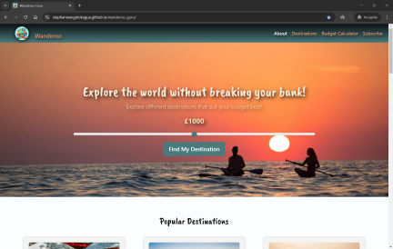
 
 - Edge

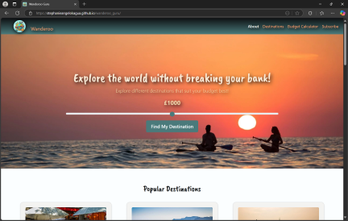

| **Browser Compatibility** | Chrome | Edge  |
|----------------------------|--------|-------|
| **Intended appearance?**   | Good   | Good  |
| **Intended responsiveness?**| Good   | Good  |
                                  

No issues were found when using all of the listed browsers, all performed with the  intenend appearance and responsiveness.

### Accessibility Testing

### Lighthouse

### Responsive Testing

#### Iphone XR Screenshots

    
Hero section on iphone XR

    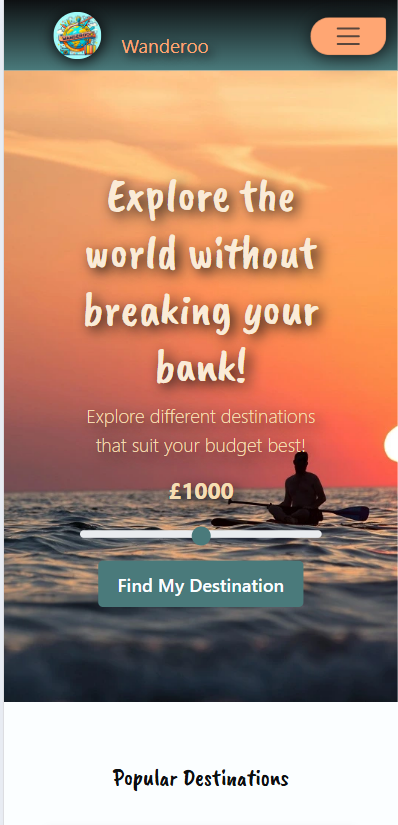
    

    
Destinations section on iphone XR

    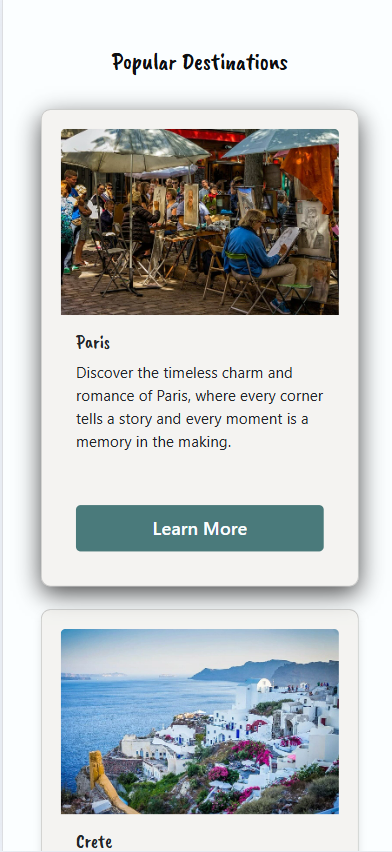
    

    
Budget Calculator section on iphone XR

    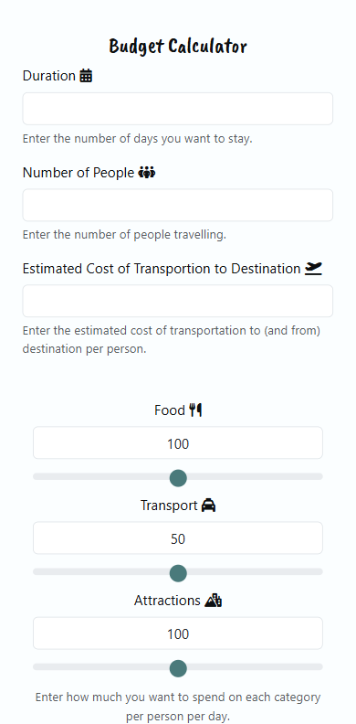
    

    
Footer on iphone XR

    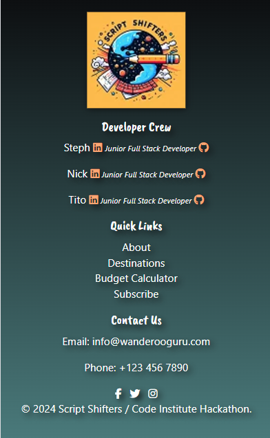
    

#### Ipad Pro Screenshots

    
Hero section on Ipad Pro

    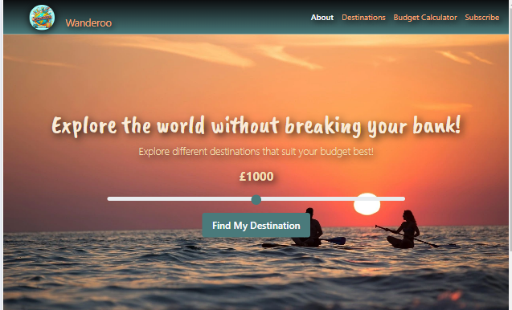
    

    
Destinations section on Ipad Pro

    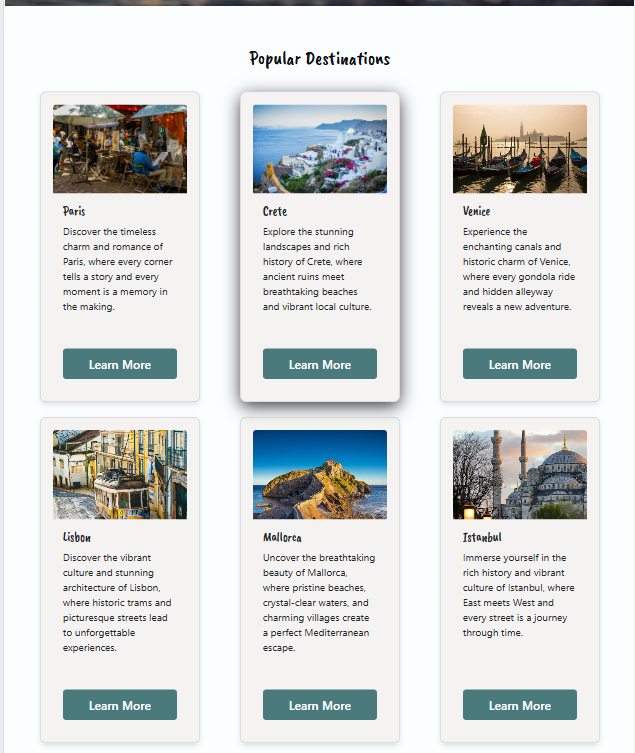
    

    
Budget Calculator section on Ipad Pro

    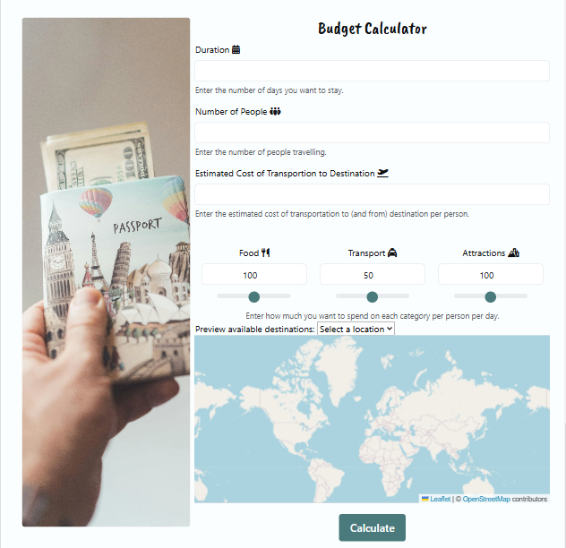
    

    
Footer on Ipad Pro

    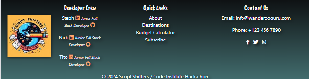
    

#### Nest Hub Screenshots

    
Hero section on Nest Hub

    
    

    
Destinations section on Nest Hub

    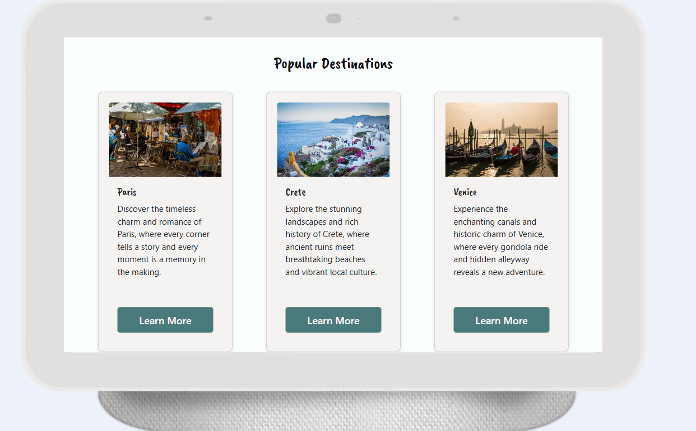
    

    
Budget Calculator section on Nest Hub

    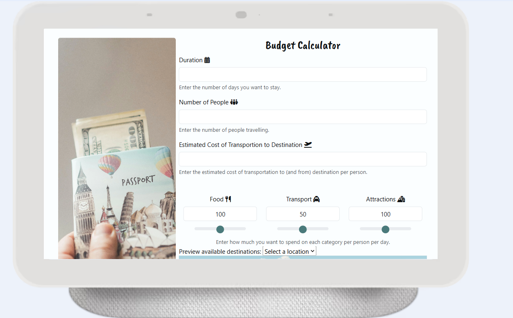
    

    
Footer on Nest Hub

    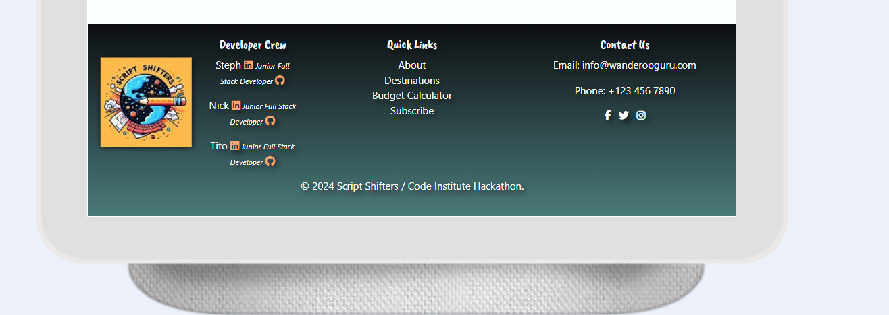
    

### Validator Testing

- HTML

- CSS

- Javascript

## Bugs

### Bug 1

Fix

- Removed links to the manifest as not required at present but maybe for future development of a Progressive Web App (PWA)

### Bug 2
 - Hero image not displaying.

Fix

After exploring potential errors in the code such as unclosed blocks and wrongly addressed links, it was recognised that the error was due to a misaligniment of variables set in the root of the css file. Aligning these variables in the css file resulted in fixing the issue.

## Deployment

During this project, Git was an essential tracking tool used to monitor the progress of the website towards final deployments. Git commits were used to allow version tracking and restoring previous states if needed amongst Git push, Git pull, Git add. These commits were stored and Github was used to store the project and deploy the site.

GitHub was used to deploy the website. These were the steps taken to acheive this:  

1. Login to GitHub account
2. Navigate to the project repository, mental_health_deserves_awareness
3. Click the Settings button near the top of the page
4. In the left-hand menu, find and click on the Pages button
5. In the Source section, choose 'main' from the drop-down, select branch menu
6. Select 'root' from the drop-down folder menu
7. Click 'Save' and after a few moments the project will have been made live and a link is visible at the top of the page
   
## Credits

### Content

### Technologies

- [Leaflet](https://leafletjs.com/reference.html) - Open source street map, data available under the Open Database License.
- Git - version control
- Github - deployment and project management
- HTML 
- CSS
- Bootstrap
- Fontawesome
- Open AI
- VS code
- Beautify formatter extension
- Pexels
- Favicon.io
- Google fonts

### Media

- Images to webp [FreeConvert](https://www.freeconvert.com)

- Hero image [pexels](https://images.pexels.com/photos/165505/pexels-photo-165505.jpeg)

- Holiday location images [Pixabay](https://pixabay.com)

- Favicon converter [Favicon.io](https://favicon.io)

- Copilot used for logo generating of favicon and Script Shifters emblem

## Future Features

- **Travel Blog**
    - A dedicated section for travel blogs where users can read and share their travel experiences, tips, and stories.

- **Travel Tips**
    - A comprehensive guide with travel tips, including packing lists, safety advice, and budget-friendly travel hacks.

- **User Testimonies**
    - A section for user testimonials where travelers can share their feedback and experiences about the destinations they visited.

- **Coordinate Flight**
    - Integration with flight booking services to help users find and book flights that fit their budget and travel plans.

- **Budget Information on Map Pinpoints**
    - Adding budget information to the map pinpoints to provide users with a quick overview of the estimated costs associated with each destination.

- **Personalized Recommendations**

    - Implementing a recommendation engine that suggests destinations based on users' past searches and preferences.

- **Local Experiences**
    - A section dedicated to local experiences and activities, providing users with unique and authentic travel options.

- **Currency Converter**
    - Adding a currency converter tool to help users understand the costs in their local currency.

- **Weather Forecast**
    - Integrating a weather forecast feature for each destination to help users plan their trips better.

- **Travel Insurance Options**
    - Providing information and options for travel insurance to ensure users are covered during their trips.

- **Language Translation**
    - Incorporating a language translation feature to assist users in navigating foreign destinations.

- **User Profiles**
    - Allowing users to create profiles to save their favorite destinations, itineraries, and travel preferences.

- **Social Media Integration**
    - Enabling users to share their travel plans and experiences directly to their social media accounts.

- **Virtual Tours**
    - Offering virtual tours of destinations to give users a preview of what to expect.

- **Travel Deals and Discounts**
    - Highlighting special travel deals and discounts to help users save money on their trips.

## Team Collaboration

    

Working as a team to produce this website has been an enriching experience that has significantly enhanced our problem-solving skills and confidence in various aspects of web development. We collaborated closely, leveraging each team member's strengths and expertise to overcome challenges and implement design features effectively.

### Problem Solving

Throughout the project, we encountered several obstacles that required innovative solutions. By brainstorming together and discussing different approaches, we were able to resolve issues efficiently. This collaborative problem-solving process not only improved the quality of our work but also fostered a strong sense of teamwork and mutual support.

### Independent Initiative

While teamwork was crucial, we also took the initiative to work independently on specific tasks. This balance allowed us to progress steadily, as each member contributed to different parts of the project simultaneously. Our ability to manage individual responsibilities while maintaining cohesive communication was key to our success.

### Confidence with Git Branches

One of the significant skills we developed was the use of Git branches. By creating and managing branches for different features and fixes, we ensured a smooth workflow and minimized conflicts. This practice has built our confidence in version control and collaborative coding, making us more proficient in handling complex projects.

### Developing Coding Skills in HTML, CSS, and JavaScript

Throughout the development of this project, we have significantly enhanced our coding skills in HTML, CSS, and JavaScript. By working on various components of the website, we gained practical experience in structuring web pages, styling them to create visually appealing designs, and adding interactivity to enhance user engagement. This hands-on approach allowed us to deepen our understanding of these core web technologies, improve our problem-solving abilities, and become more proficient in creating dynamic and responsive web applications.

### Implementing AI to Support Our Development Goals

Integrating AI into our development process has been instrumental in achieving our project goals. AI tools have supported us in various aspects, including problem-solving, clarifying understanding, idea generation, image creation, and debugging. By leveraging AI, we were able to quickly generate innovative solutions to complex problems, gain deeper insights into challenging concepts, and produce creative ideas that enhanced our project's overall quality. Additionally, AI-assisted image creation allowed us to develop visually appealing graphics efficiently, while AI-driven debugging tools helped us identify and resolve code issues promptly. This integration of AI has significantly streamlined our workflow and contributed to the successful completion of our project.

### Design Implementation

Implementing the design elements of the website required meticulous attention to detail and a clear understanding of user experience principles. Through regular feedback sessions and iterative improvements, we were able to refine our design to meet the project's goals. This process has enhanced our ability to translate design concepts into functional and visually appealing web pages.

Overall, this project has been a valuable learning experience, strengthening our technical skills and teamwork capabilities. We are proud of the website we have created and the collaborative effort that made it possible.
